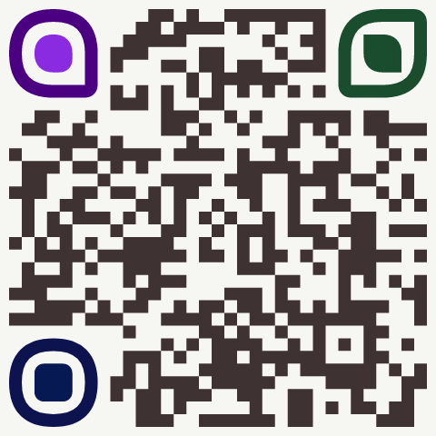

# Styled QRCode


Generate a customizable styled QRCode worked in NodeJS/Browser with TypeScript supported.

|  |  |
|---|---|
|  |  |

## Installation

```bash
# Using npm
npm install sqrc

# Using yarn
yarn add sqrc

# Using pnpm
pnpm add sqrc
```

## Usage

```ts
const qr = new QRCode('https://github.com/monodyle/sqrc')
qr.render() // image buffer
```

## Options

### `ecc`

- Type: `ErrorCorrectionLevel` (`L` | `M` | `Q` | `H`)
- Default: `H`

Error correction level

### `size`

- Type: `number`
- Default: `150`

Size (width and height) of the output render

### `quietZone`

- Type: `number`
- Default: `10`

The gap between image edge and QR code content

### `foreground`

- Type: `string | QRColorGradient` (CSS color value string)
- Default: `#000`

Color of the foreground content

### `background`

- Type: `string | QRColorGradient` (CSS color value string)
- Default: `#fff`

Color of the background image

### `moduleStyle`

- Type: `'square' | 'dots' | 'rounded' | 'extraRounded' | 'classy'`
- Default: `squares`

Style of the QR modules


### `moduleGap`

- Type: `number`

Gap between QR modules (worked for `moduleStyles` with values: `'square' | 'dots'`)

### `logo.url`

- Type: `string`

URL string of the logo in the center of QR

### `logo.width`

- Type: `number`

Logo width

### `logo.height`

- Type: `number`

Logo height

### `logo.padding`

- Type: `number`

Padding around logo

### `logo.style`

- Type: `'square' | 'circle'`

Style of the QR padding

### `eyes.radius`

- Type: `QREyeCornerRadius | [QREyeCornerRadius, QREyeCornerRadius, QREyeCornerRadius]`

The corner radius for the QR eyes

### `eyes.color`

- Type: `QREyeColor | [QREyeColor, QREyeColor, QREyeColor]`

The color for the qr eyes

## Eyes Type explaination

`QREyesOptions` is an object type that may have two properties: `radius` and `color`. Both properties can either take single values or an array of three values, each corresponding to a different "eye" of the QR code.

```ts
type QREyesOptions = {
  radius?:
    | QREyeCornerRadius
    | [QREyeCornerRadius, QREyeCornerRadius, QREyeCornerRadius]
  color?: QREyeColor | [QREyeColor, QREyeColor, QREyeColor]
}

type QREyeColor = string | QRInnerOuterEyeColor
type QRInnerOuterEyeColor = {
  inner: string
  outer: string
}

type QREyeCornerRadius =
  | number
  | [number, number, number, number]
  | QREyesInnerOuterRadius
type QREyesInnerOuterRadius = {
  inner: number | [number, number, number, number]
  outer: number | [number, number, number, number]
}
```

The `eyes.radius` property can take values of type `QREyeCornerRadius`, which determines the roundness of the 'eyes'. It can be a single number, an array of four numbers (in order: top-left, top-right, bottom-right, bottom-left), or an object with `inner` and `outer` properties, each being a number or an array of four numbers.

Same with the `color` property, it can take values of type `QREyeColor`, which determines the color of the `eyes`. It can be a string specifying a color or an object with `inner` and `outer` properties, each being a string specifying a color.



Example (output is the image on the right):

```ts
new QRCode('https://github.com/monodyle/sqrc', {
  size: 480,
  background: '#f2f1eb9f',
  foreground: '#3e3232',
  eyes: {
    radius: [
      [48, 48, 8, 48],
      {
        outer: [48, 8, 48, 8],
        inner: [0, 48, 0, 48]
      },
      { inner: 4, outer: 100 }
    ],
    color: [
      {
        inner: 'blueviolet',
        outer: 'indigo'
      },
      '#1a4d2e',
      {
        inner: '#071952',
        outer: '#0c134f',
      },
    ]
  }
})
```

# Credits

- Inspired and based on the ideas of [gcoro/react-qrcode-logo](https://github.com/gcoro/react-qrcode-logo) which support React.
