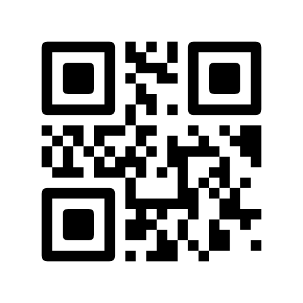
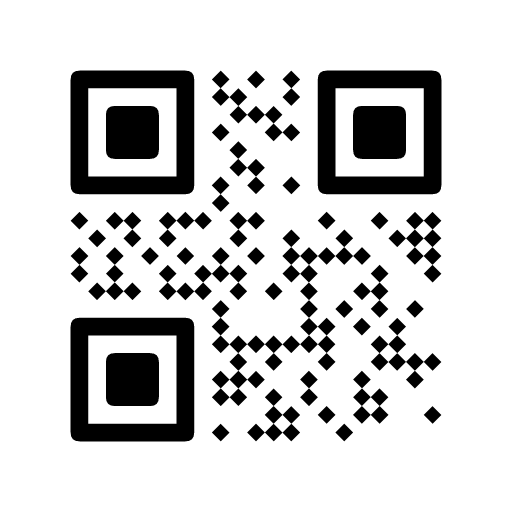
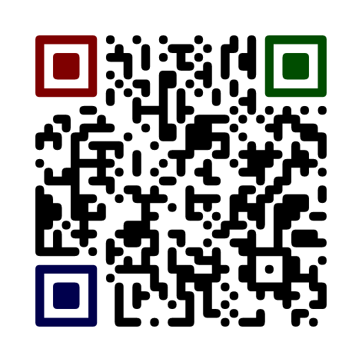

# Styled QRCode


A customizable, styled QR code generator for Node and the browser, written in TypeScript.
The SVG and canvas outputs pull in zero native dependencies, so they work anywhere a string or a 2D context does.

|   |   |
| ------------------------------------------------- | ------------------------------------------------- |
|  |  |

## Installation

```bash
# Using npm
npm install sqrc

# Using yarn
yarn add sqrc

# Using pnpm
pnpm add sqrc
```

## Usage

```ts
import { QRCode } from 'sqrc'

const qr = new QRCode('https://github.com/monodyle/sqrc')

// SVG string, no native deps, works in Node and the browser
const svg = await qr.toSvg(300)

// Draw into any 2D context (a DOM canvas, or @napi-rs/canvas in Node)
await qr.toCanvas(ctx, 300)

// PNG buffer (Node only, requires @napi-rs/canvas)
const png = await qr.toPng(300)
```

## Render methods

All three methods are async and take the output size in pixels as their first argument.
They share the same options object (see [Options](#options)).

- `toSvg(size, options?)` returns a `Promise<string>`, an `<svg>` you can inline or save.
- `toCanvas(ctx, size, options?, logoImage?)` replays the same geometry into a 2D context you provide.
- `toPng(size, options?)` returns a `Promise<Buffer>` by rendering through `@napi-rs/canvas`.

`@napi-rs/canvas` is an optional peer dependency.
`toSvg` and `toCanvas` never load it, so browser bundles and SVG-only users stay free of native code.
Only `toPng` imports it, and only when you call it.

When a logo is configured, the browser `toCanvas` cannot decode image bytes on its own, so pass the decoded image as `logoImage` (an `HTMLImageElement` in the browser, the `@napi-rs/canvas` image in Node).
`toPng` decodes the logo for you.

## Options

### Constructor

`new QRCode(value, options?)` takes the encoded string and an options object with two fields.

#### `errorCorrectionLevel`

- Type: `'L' | 'M' | 'Q' | 'H'`
- Default: `'M'`

The error correction level.
Raise it when you place a logo in the center, since the logo knocks out modules that error correction has to recover.

#### `version`

- Type: `number`

Force a specific QR version.
Leave it unset to let the encoder pick the smallest version that fits the value.

### Render options

These go in the options object passed to `toSvg`, `toCanvas`, and `toPng`.

#### `shape`

- Type: `'square' | 'circle' | 'rounded' | 'diamond'`
- Default: `'rounded'`

The shape of the body modules.

#### `eyePatternShape`

- Type: `'square' | 'rounded'`
- Default: `'rounded'`

The shape of the three finder eyes.
The alignment pattern is drawn as a body module, so it follows `shape` and `gap`.
Only solid shapes are allowed here, because a circle or diamond eye would break the solid region scanners use to locate the code.

#### `gap`

- Type: `number`
- Default: `0`

The gap, in pixels, between adjacent body modules.

#### `eyePatternGap`

- Type: `number`
- Default: `0`

The gap, in pixels, around the finder eye modules, independent of `gap`.

#### `foreground`

- Type: `string | GradientSpec`
- Default: `'#000'`

The color of the modules.
Accepts any CSS color string, or a [gradient](#gradients).

#### `background`

- Type: `string | GradientSpec`
- Default: `'#fff'`

The color of the background field.
Accepts any CSS color string, or a [gradient](#gradients).

#### `eyeColor`

- Type: `FillSpec | [FillSpec, FillSpec, FillSpec]`

The color of the finder eyes, overriding `foreground` for the eyes only.
A single value colors all three eyes; a three-element array colors them in the order top-left, top-right, bottom-left.
Each entry is a [color or gradient](#gradients).

### Logo

#### `logo.url`

- Type: `string | Uint8Array | ArrayBuffer`

The logo placed in the center of the code.
Pass a `data:` URL or the raw image bytes.
Remote `http(s)` URLs are not fetched here, to keep the library free of any network dependency: fetch the image yourself first and pass the resulting bytes or data URL.

#### `logo.width`

- Type: `number`
- Default: 20% of the output size

The logo width in pixels.

#### `logo.height`

- Type: `number`
- Default: same as `logo.width`

The logo height in pixels, honored independently of the width.

#### `logo.padding`

- Type: `number`
- Default: `0`

Padding around the logo, in pixels.

#### `logo.opacity`

- Type: `number`
- Default: `1`

The logo opacity, from 0 to 1.

#### `logo.style`

- Type: `'square' | 'circle'`
- Default: `'square'`

Clips the logo to a circle when set to `'circle'`.

#### `logo.emptyBackground`

- Type: `boolean`
- Default: `false`

Knocks out the modules behind the padded logo area and fills it with the background color, so the logo sits on a clean field instead of touching live modules.

## Gradients

Any color field (`foreground`, `background`, or an `eyeColor` entry) can be a gradient instead of a flat color.

```ts
type FillSpec = string | GradientSpec

type GradientSpec = {
  type?: 'linear' | 'radial'
  from: string
  to: string
  rotation?: number // radians, linear gradients only
}
```

A linear gradient runs left to right by default; set `rotation` to angle it.
Gradients are scoped to the fill they color, so a gradient foreground keeps the eyes readable when you give them their own `eyeColor`.

## Eyes



Color the three finder eyes independently with an `eyeColor` array, and shape them with `eyePatternShape`.
The example on the right:

```ts
await new QRCode('https://github.com/monodyle/sqrc', {
  errorCorrectionLevel: 'H',
}).toSvg(480, {
  shape: 'rounded',
  eyePatternShape: 'rounded',
  eyeColor: ['#7f0000', '#004d00', '#00004d'],
})
```

A styled code with a centered logo, the one shown at the top of this page:

```ts
await new QRCode('https://github.com/monodyle/sqrc', {
  errorCorrectionLevel: 'H',
}).toSvg(480, {
  shape: 'rounded',
  foreground: { from: '#1a1a2e', to: '#0d0d17', rotation: Math.PI / 4 },
  logo: {
    url: logoBytes,
    width: 96,
    height: 96,
    padding: 8,
    emptyBackground: true,
  },
})
```

## Migrating from 0.x

The render call changed from a single `render()` to `toSvg`, `toCanvas`, and `toPng`, each taking the size as an argument instead of reading it from options.
`ecc` is now `errorCorrectionLevel` and moved to the constructor, and it defaults to `'M'`.
`moduleStyle` is now `shape`: `dots` became `circle`, `extraRounded` and `classy` were dropped, and `diamond` was added.
The old `eyes.radius` and per-corner `eyes.color` objects are gone; eyes are now shaped by `eyePatternShape` and colored by `eyeColor`.
`logo.url` no longer fetches a remote URL, so pass a data URL or raw bytes, and `logo.height` is now respected.
The quiet zone is a fixed 4-module margin and is no longer a configurable option.

## Credits

- Inspired by and based on the ideas of [gcoro/react-qrcode-logo](https://github.com/gcoro/react-qrcode-logo), which targets React.
